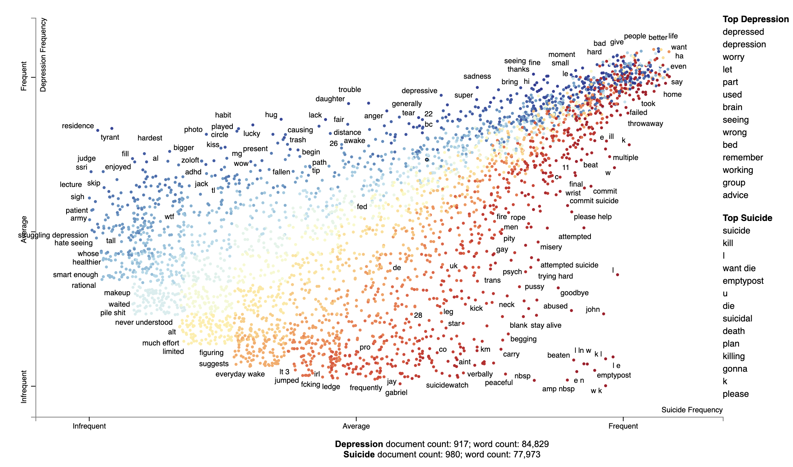

# SAVE WORLD: Using Natural Language Processing(NLP) to Identify Suicidal Posts on Reddit

---

> "*When you are tempted to give up, your breakthrough is probably just around the corner.*"

## Overview
This project aims to leverage Natural Language Processing (NLP) techniques to identify potentially suicidal posts on Reddit. By analyzing posts from two subreddits—r/depression and r/SuicideWatch—we aim to provide support and intervention for individuals at risk.

### Subreddits and Mission Statements
- **r/depression**: Because nobody should be alone in a dark place.
- **r/SuicideWatch**: Peer support for anyone struggling with suicidal thoughts.

## Project Structure

```
SAVE WORLD: Using Natural Language Processing to identify suicidal posts
|__ code
|   |__ 01_Data_Collection.ipynb   
|   |__ 02_Data-Cleaning_Pre-processing_EDA.ipynb   
|   |__ 03_Modelling.ipynb 
|__ data
|   |__ combined_data.csv
|   |__ data_for_model.csv
|   |__ depression.csv
|   |__ suicide_watch.csv
|__ images
|   |__ (various_images_used_for_masking)
|__ HTML_corpus.html
|__ README.md
```


## Notebooks
- `01_Data_Collection.ipynb`: Notebook for collecting data from Reddit.
- `02_Data-Cleaning_Pre-processing_EDA.ipynb`: Notebook for data cleaning, pre-processing, and exploratory data analysis.
- `03_Modelling.ipynb`: Notebook for building and evaluating NLP models.

## Data
- `combined_data.csv`: Combined dataset containing posts from both subreddits.
- `data_for_model.csv`: Processed data suitable for model training and evaluation.
- `depression.csv`: Raw data from the r/depression subreddit.
- `suicide_watch.csv`: Raw data from the r/SuicideWatch subreddit.

### Visualisations
 

